# FAST-LIO-MULTI
+ This repository is a [FAST-LIO2](https://github.com/hku-mars/FAST_LIO)'s extended version of multi-LiDAR
+ Optionally, user can choose one of bundle update method vs asynchronous update vs adaptive update method

## Related video: https://youtu.be/YQmjKMoBPNU

<br>

## Dependencies
+ `ROS`, `Ubuntu`, `PCL` >= 1.8, `Eigen` >= 3.3.4
+ [`livox_ros_driver`](https://github.com/Livox-SDK/livox_ros_driver)
```shell
cd ~/your_workspace/src
git clone https://github.com/Livox-SDK/livox_ros_driver
cd ..
catkin build -DCMAKE_BUILD_TYPE=Release
```

## How to build and run
+ Get the code, and then build
```shell
cd ~/your_workspace/src
git clone https://github.com/engcang/FAST_LIO_MULTI

cd ..
catkin build -DCMAKE_BUILD_TYPE=Release
. devel/setup.bash
```
+ Then run
```shell
roslaunch fast_lio_multi run.launch update_method:=bundle
roslaunch fast_lio_multi run.launch update_method:=async
roslaunch fast_lio_multi run.launch update_method:=adaptive
```

<br>

## Update methods: bundle vs asynchronous vs adaptive
+ Bundle update: merge multi LiDAR scans into one pointcloud, and then update
	+ Prevent no scan data input in extreme situation, e.g., high altitude flight of drones
	+ Longer update interval (which may cause drift during aggresive and fast movement from state propagation with only IMU)
	+ **NOTE: current code implementation will properly work for LiDARs with same scan rates (e.g., same 10Hz)**
+ Asynchronous update: update the filter whenever LiDAR scan inputs
	+ Shorter update interval (which may reduce drift from state propagation with only IMU)
	+ Depending on the sensor configuration, none-scanned data update may occur (which may result in divergence)
+ Adaptive update method
  + Asynchronous update => bundle update (only when data in FoV is not enough) => asynchronous update
  + Shorter update interval + preventing no scan data input!

<p align="center">
  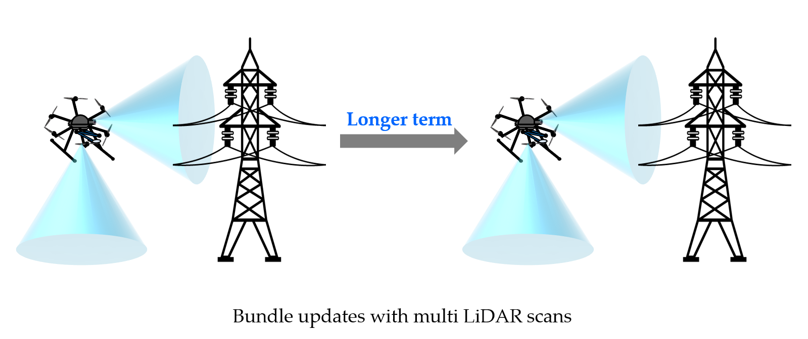
  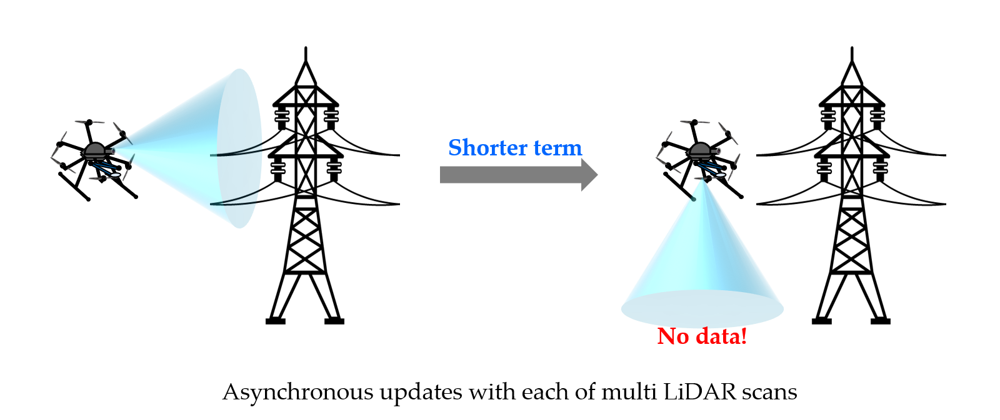
  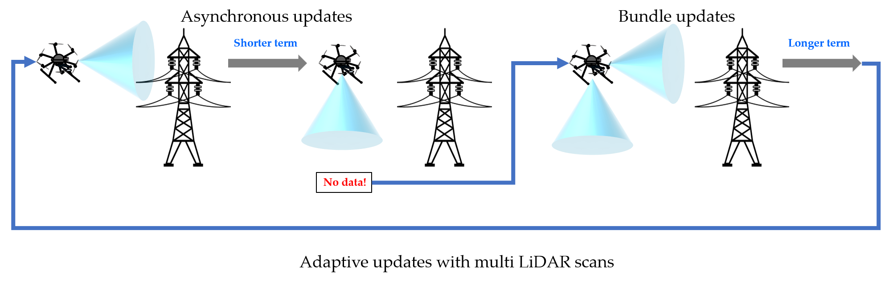
  <br>
  <em>Update methods - (upper): Bundle, (middle): Asynchronous, (bottom): Adaptive</em>
</p>

+ By utilizing the forward and backward propagation structure of FAST-LIO2, each update method is implemented as follows:
<p align="center">
  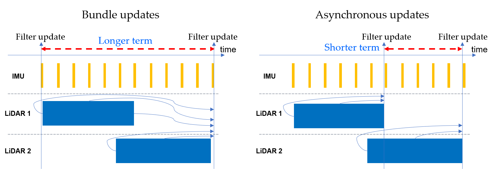
  <br>
  <em>Update methods - (left): Bundle (right): Asynchronous</em>
</p>

<br>

## Results of each method (for better understanding, please watch the [related video](https://youtu.be/YQmjKMoBPNU))
+ For two sensor configurations,
	+ Config1: Livox-MID360 x 2EA (each is tilted +143, -143 degree)
	+ Config2: Livox-MID360 x 1EA (0 degree tilted), Livox-AVIA x 1EA (90 degree tilted)

<p align="center">
  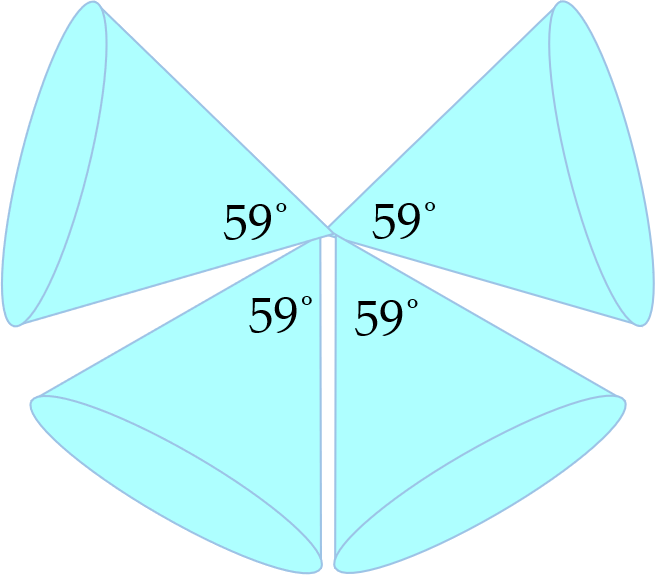
  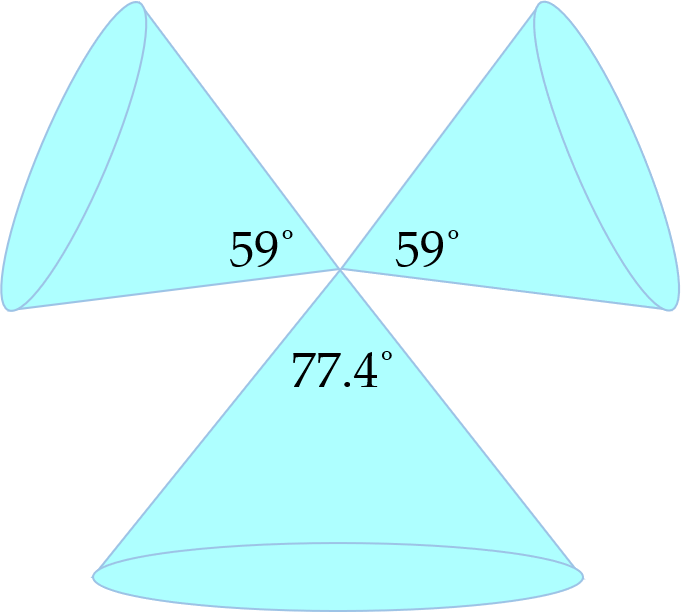
  <br>
  <em>Sensor config - (left): config1 (right): config2</em>
</p>

+ For aggresive motion and middle-altitude flight situation with sensor config1, asynchronous update method shows better performance
	+ Green: ground-truth, turquoise: FAST-LIO-MULTI
<p align="center">
  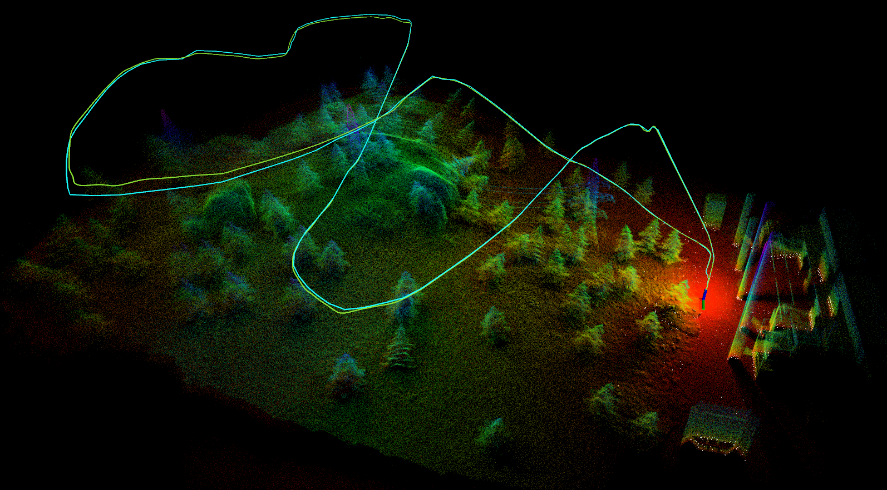
  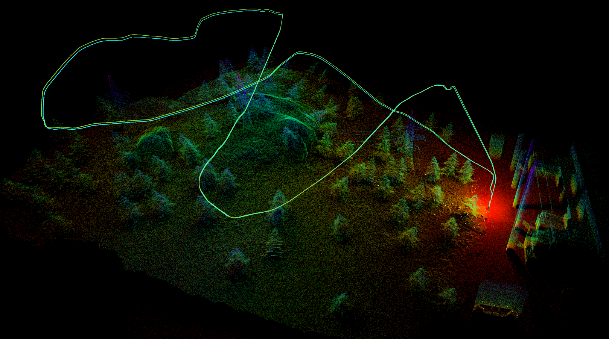
  <br>
  <em>Side view - (left): Bundle (right): Async</em>
</p>
<p align="center">
  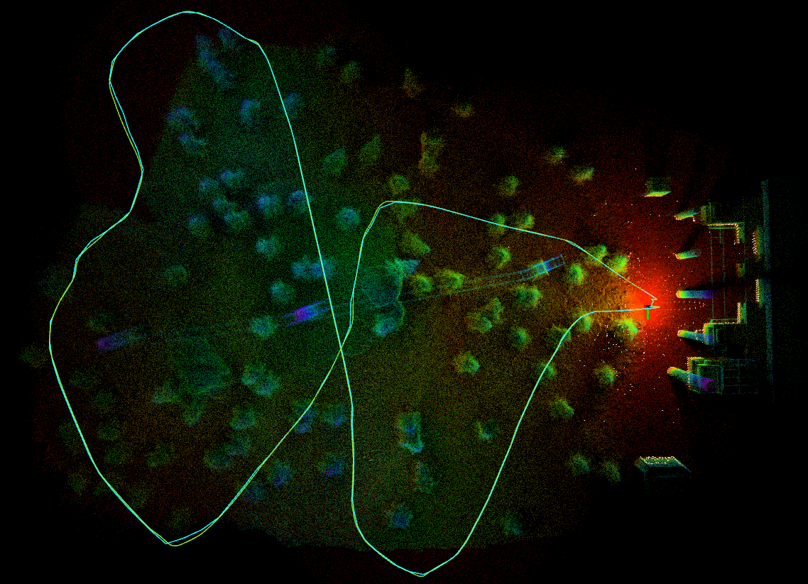
  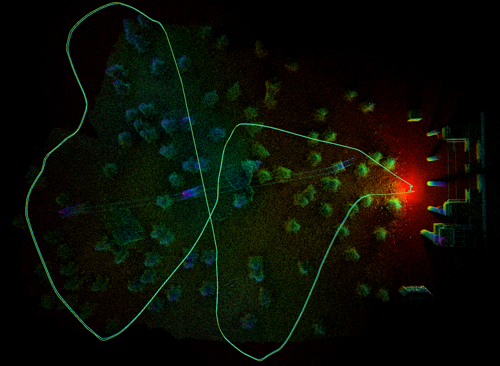
  <br>
  <em>Top view - (left): Bundle (right): Async</em>
</p>

+ For high-altitude flight situation (no many scanned data) with sensor config2, bundle update method shows better and robust performance
	+ Green: ground-truth, turquoise: FAST-LIO-MULTI
<p align="center">
  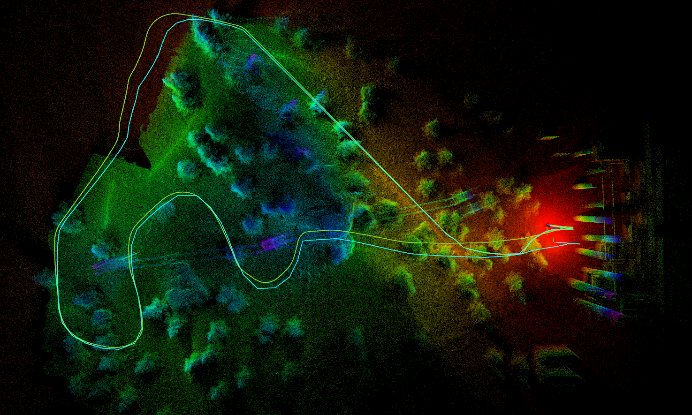
  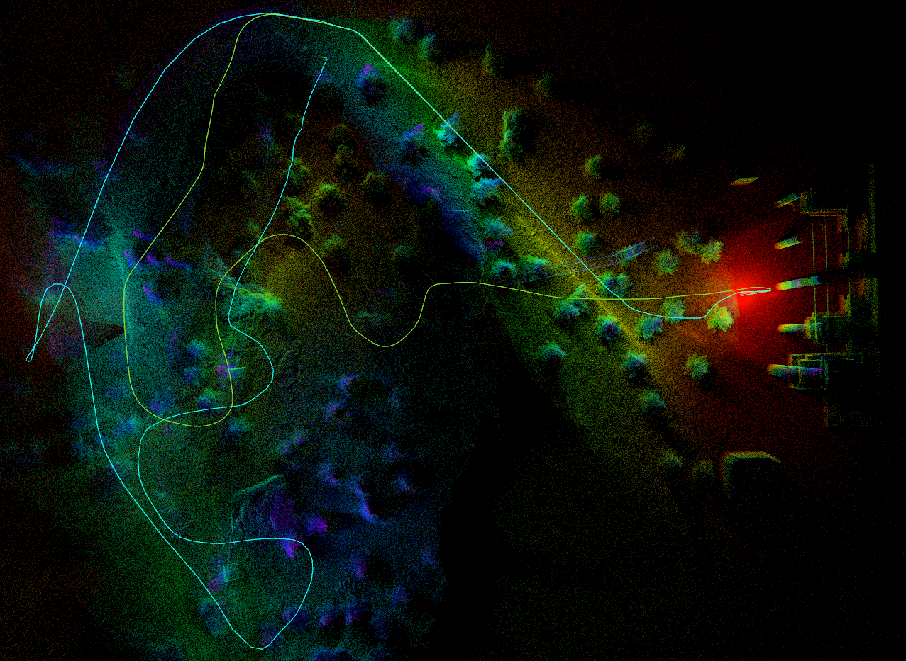
  <br>
  <em>Top view - (left): Bundle (right): Async</em>
</p>
<p align="center">
  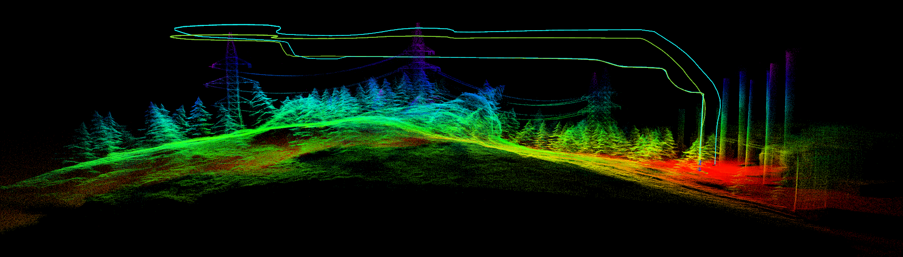
  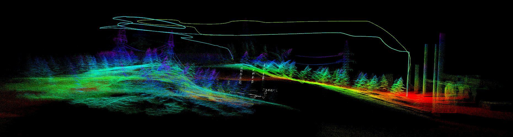
  <br>
  <em>Side view - (left): Bundle (right): Async</em>
</p>
